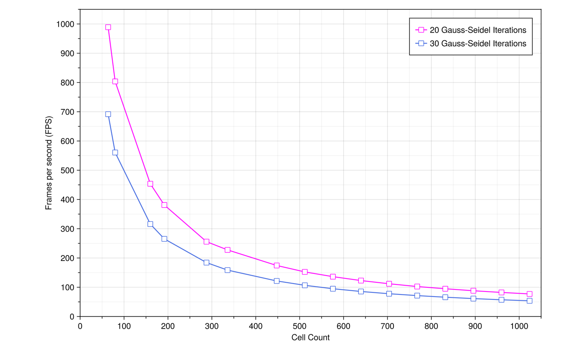

# [Stable Fluids](https://github.com/Luiulator/ESP32-stableFluids)

A C++ port of [my Julia module](https://github.com/Luiulator/colourlessFD) that implements the Stable Fluids algorithm, which is commonly used to simulate smoke and other slightly dense gaseous flows in videogames in real time. It is quite lightweight and unconditionally stable. As such, modern microcontrollers like the ESP32 should be able to run it at sufficient framerates for it to look "fluid" enough too. This is my attempt at that, just for fun.

## A few Highlights

This software solves the incompressible Navier-Stokes equations. That's the Continuity Equation

$$ \nabla \cdot \mathbf{u} = 0 $$

and the Momentum Equation

$$ \frac{\partial \mathbf{u}}{\partial t} + (\mathbf{u} \cdot \nabla) \mathbf{u} = \nu \nabla^2 \mathbf{u} + \frac{1}{\rho} \nabla p + \frac{1}{\rho}\mathbf{f} $$

It does so by breaking down each term of the sum and solving them separately, then summing up. Lastly, it applies a correction pressure so that we enforce that the fluid remains incompressible.

The default case I implemented consists of a constant jet of fluid in the direction of the gravitational acceleration. This can be changed, but you will need to code your own setup for that in the `void()` and `loop()` functions

The simulation renders in an I2C OLED Screen using the Adafruit libraries. The original rendering was pretty dull (the screen is 1-bit monochromatic, so it can technically only represent pure black or pure white). To get around this, I implemented a [dithering](https://en.wikipedia.org/wiki/Dither) matrix to at least be able to differentiate 5 types of grayscale colours going from pure black to pure white. A similar technique was used by the Gameboy developers back in the 90s to try and make colours differentiable in the basic screens they had, which is what I drew inspiration from. This is of course just a visual trick for your brain, and trying to record it with a modern camera sort of takes the magic away from it, as everything will look closer to white overall.

Lastly, Stable Fluids is, as per its name, unconditionally stable. That means you won't get infinite velocities, vorticities or whatever magnitudes, under any circumstance. It is then theoretically possible to use a $dt$ as large as you wish, although at some point the physics will completely break. Feel free to tweak it and find out!

*Be advised!!!* As a tradeoff for the unconditional stability, this method sacrifices precise recreation of fluid dynamics. You should expect very vortical and fluid-like motion, but do not use it for any sensitive purpose as it will not behave physically. If you are looking to solve a fluid problem in a way that preserves real behaviour, you should start looking [somewhere else](https://en.wikipedia.org/wiki/Reynolds-averaged_Navier%E2%80%93Stokes_equations) and, most importantly, far away from any microcontroller.

## Some Benchmarks

The maximum amount of cells I tried to simulate were 1024 cells in a 64 x 16. The RAM on the ESP32 should allow for a lot more, but that is all I needed. Feel free to tweak it.

  <table>
    <tr>
      <td align="center" width="50%">
        
         
        <b>Gauss-Seidel Solver Performance (FPS vs Grid Size)</b>
      </td>
    </tr>
  </table>

## Pinout

The screen uses only four pins on the ESP32 devkit, so describing it in text should be enough. The `VCC` pin on the OLED screen goes to the `3V3` pin on the ESP. `GND` to `GND`. And then `SDA` and `SCL` go to `GPIO #21` and `GPIO #22` respectively.

## Future Work

A list of a few things I still want to try when coming back to this project

- Parallelization with Red-Black Gauss-Seidel instead of classic, sequential Gauss-Seidel.
- Using one core of the ESP for the calculations and another for the rendering, and comparing results with current benchmarks.
- Extending this (fairly unrealistic) method to plasmas.